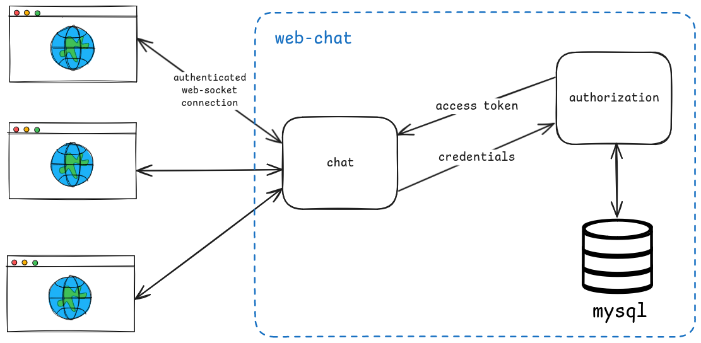

# Web-Chat Project

<!--  -->

A real-time web chat application that leverages WebSocket for seamless communication between clients. This application includes a secure authentication flow and internal networking, ensuring that only authorized users can access the chat.

## Overview

The web-chat application allows users to join a chat room and communicate in real-time. Users authenticate by providing their credentials, which are validated by an authorization service. Upon successful authentication, the connection is upgraded to a WebSocket connection for live messaging.

## Features

- **User Authentication**: Credentials are securely validated by an authorization service.
- **WebSocket Communication**: Real-time chat functionality is enabled by upgrading the HTTP connection to WebSocket after authentication.
- **Internal Networking**: All services (Chat, Authorization, and SQL) communicate through an exclusive internal network, enhancing security.
- **SQL Database**: Client information, including usernames and PBKDF2-opaque passwords, is stored securely in an SQL database.
- **Secure**: Only authenticated users with valid tokens can access the chat.

## Architecture

The following diagram illustrates the architecture of the web-chat application:



### Components:

1. **Client (Browser)**:
   - The client interface allows users to enter their credentials and chat messages.
   - It sends an HTTP request to the server with user credentials for authentication.

2. **Server**:
   - Receives HTTP requests and interacts with the authorization service for credential validation.
   - Once authenticated, it upgrades the connection to WebSocket, managing real-time chat messages and broadcasting them to all connected clients.

3. **Authorization Service**:
   - Validates user credentials received from the server.
   - If credentials are valid, it generates and returns an access token, allowing access to the chat service.

4. **SQL Database**:
   - Stores user credentials (username and password) using PBKDF2 for password hashing.
   - Only accessible via the internal network, ensuring that sensitive data is securely stored and managed.

5. **Internal Network**:
   - An exclusive internal network for SQL, Chat, and Authorization services ensures isolated and secure communication between these services.

## How It Works

### 1. Client Sends Credentials
   - The user enters their username and password into the client interface.
   - An HTTP POST request is sent to the server with these credentials.

### 2. Server Validates Credentials
   - The server forwards the credentials to the authorization service.
   - The authorization service queries the SQL database to verify credentials. If valid, an access token is generated and returned to the server.

### 3. WebSocket Connection
   - If the token is valid, the server upgrades the connection to WebSocket, enabling real-time message exchange between the client and server.

## Installation

1. **Clone the Repository**:
   ```bash
   git clone https://github.com/paulocvasco/web-chat.git
   cd web-chat
   ```

2. **Setup Environment Variables**:
   - Create a `.env` file based on `.env.example`.
   - Include configuration values for your authorization service, SQL database connection, and any other settings.

3. **Build and Run the Application**:
   ```bash
   docker compose up --build
   ```

## Usage

1. **Start the Application**:
   - Open a web browser and navigate to `http://localhost:8080`.

2. **Log In**:
   - Enter your credentials (username and password) on the login page.
   - If your credentials are valid, you will be redirected to the chat page.

3. **Start Chatting**:
   - Send and receive messages in real-time with other users in the chat room.

## Technologies Used

- **Go**: Used for server-side programming, WebSocket handling, and API endpoints.
- **JavaScript/HTML/CSS**: Client-side interface for chat and authentication.
- **Docker**: Containerizes the application and its services for easy deployment and management.
- **WebSocket**: Enables real-time messaging between clients.
- **SQL Database**: Stores client information with password hashing using PBKDF2.
- **Authorization Service**: Manages user authentication and access tokens.
- **Internal Network (Docker)**: Ensures isolated communication between the Chat, Authorization, and SQL services.
